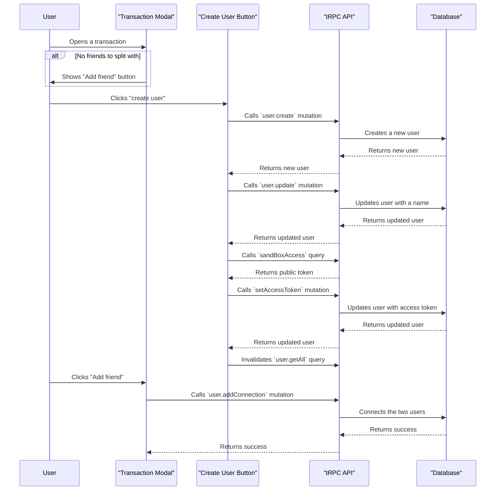

### Add Friend Sequence Diagram Documentation

This diagram illustrates the sequence of events that occur when a user adds a friend in the application.

1.  **User opens a transaction:** The user initiates the process by opening a transaction in the `TxModal`.
2.  **"Add friend" button is displayed:** If the user has no friends to split the transaction with, the `TxModal` displays an "Add friend" button.
3.  **User clicks "create user":** The user clicks the "create user" button, which is the `CreateUserBtn` component.
4.  **`user.create` mutation:** The `CreateUserBtn` component calls the `user.create` tRPC mutation to create a new user in the database.
5.  **`user.update` mutation:** After the user is created, the `CreateUserBtn` component calls the `user.update` tRPC mutation to give the new user a default name.
6.  **`sandBoxAccess` query:** The `CreateUserBtn` then calls the `sandBoxAccess` query to get a public token for the new user.
7.  **`setAccessToken` mutation:** The `CreateUserBtn` uses the public token to call the `setAccessToken` mutation, which sets the access token for the new user.
8.  **Invalidate `user.getAll` query:** The `CreateUserBtn` invalidates the `user.getAll` query to ensure that the list of users is updated to include the new user.
9.  **User clicks "Add friend":** The user clicks the "Add friend" button in the `TxModal`.
10. **`user.addConnection` mutation:** The `TxModal` calls the `user.addConnection` tRPC mutation, passing the IDs of the current user and the new user.
11. **Database update:** The tRPC API updates the database to create a connection between the two users.
12. **Success response:** The tRPC API returns a success response to the `TxModal`.
