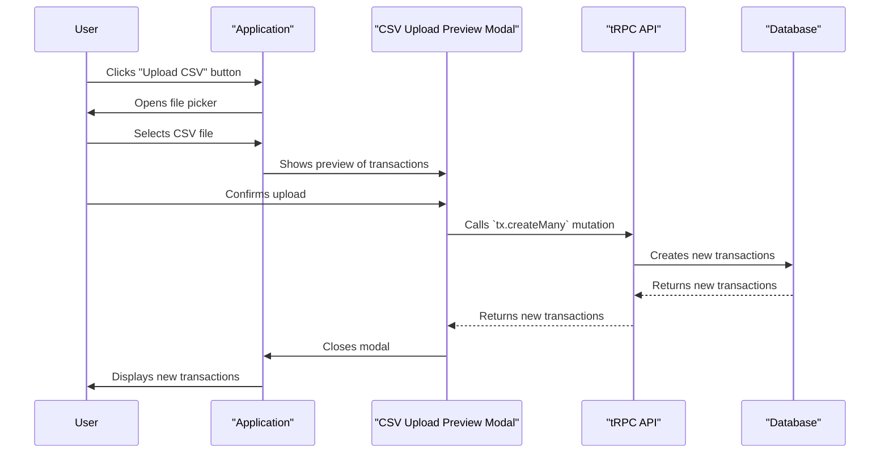

### Create Transaction Sequence Diagram Documentation

This diagram illustrates the sequence of events that occur when a user creates new transactions by uploading a CSV file.

1.  **User clicks "Upload CSV":** The user clicks the "Upload CSV" button in the application.
2.  **File picker:** The application opens the user's file picker.
3.  **User selects file:** The user selects a CSV file to upload.
4.  **CSV preview:** The application shows a preview of the transactions from the CSV file in the `CsvUploadPreviewModal`.
5.  **User confirms upload:** The user confirms that they want to upload the transactions.
6.  **`tx.createMany` mutation:** The `CsvUploadPreviewModal` calls the `tx.createMany` tRPC mutation, passing the transactions from the CSV file.
7.  **Database update:** The tRPC API creates new transactions in the database.
8.  **Success response:** The tRPC API returns the new transactions to the `CsvUploadPreviewModal`.
9.  **Modal closes:** The `CsvUploadPreviewModal` closes.
10. **Display new transactions:** The application displays the new transactions to the user.
