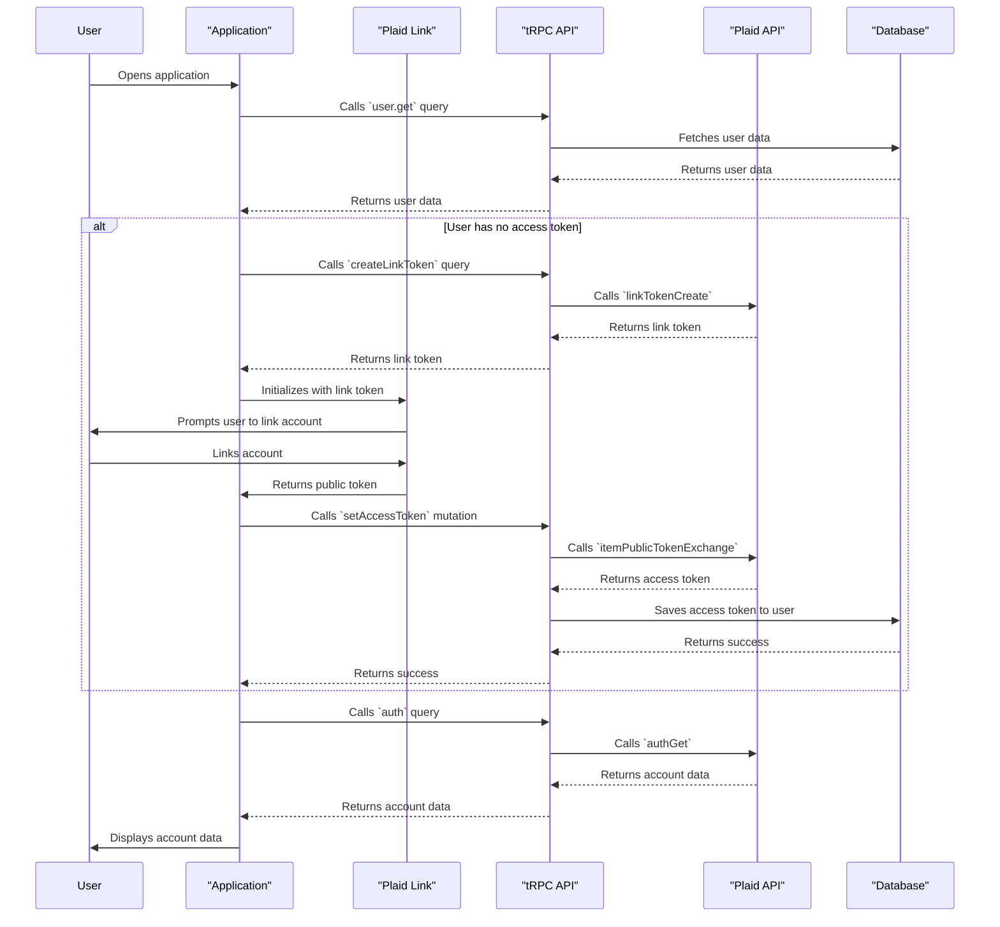

### Plaid Authentication Sequence Diagram Documentation

This diagram illustrates the sequence of events that occur when a user authenticates with the application using Plaid.

1.  **User opens application:** The user opens the application.
2.  **`user.get` query:** The application calls the `user.get` tRPC query to fetch the user's data from the database.
3.  **No access token:** If the user does not have a Plaid access token, the application initiates the Plaid Link flow.
4.  **`createLinkToken` query:** The application calls the `createLinkToken` tRPC query to get a link token from Plaid.
5.  **Plaid Link initialization:** The application uses the link token to initialize the Plaid Link component.
6.  **User links account:** The Plaid Link component prompts the user to link their bank account.
7.  **Public token:** Once the user has linked their account, Plaid Link returns a public token to the application.
8.  **`setAccessToken` mutation:** The application calls the `setAccessToken` tRPC mutation, passing the public token.
9.  **Access token exchange:** The tRPC API exchanges the public token for an access token with the Plaid API.
10. **Database update:** The tRPC API saves the access token to the user's record in the database.
11. **`auth` query:** The application calls the `auth` tRPC query to fetch the user's account data from Plaid.
12. **Display account data:** The application displays the user's account data.
