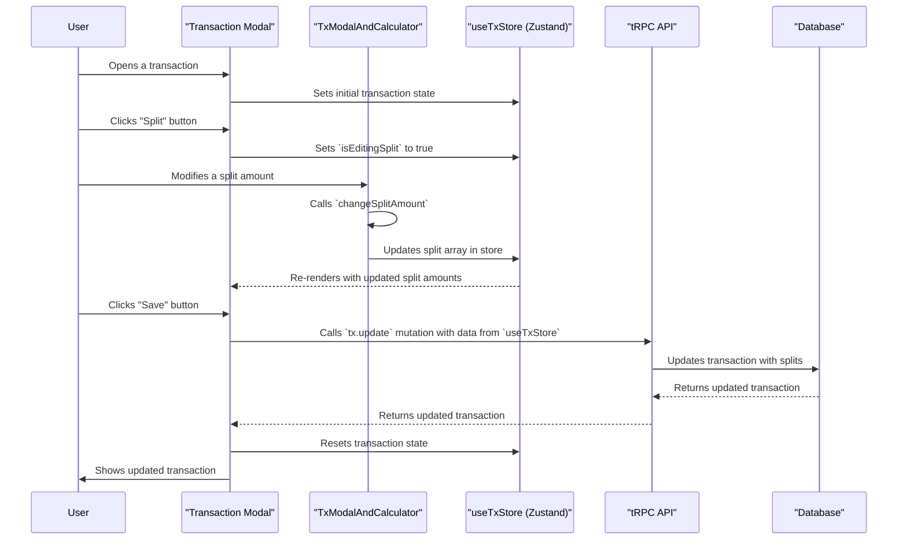

### Split Transaction Sequence Diagram Documentation (Detailed)

This diagram illustrates the sequence of events that occur when a user splits a transaction with other users.

1.  **User opens a transaction:** The user opens a transaction in the `TxModal`.
2.  **Set initial state:** The `TxModal` sets the initial state of the transaction in the `useTxStore` (a Zustand store).
3.  **User clicks "Split":** The user clicks the "Split" button to initiate the transaction splitting process.
4.  **Set editing state:** The `TxModal` sets the `isEditingSplit` state in the `useTxStore` to `true`.
5.  **User modifies split:** The user modifies a split amount in the `TxModalAndCalculator` component.
6.  **Balance splits:** The `TxModalAndCalculator` component's `changeSplitAmount` function is called, which balances the other splits to ensure the total equals the transaction amount.
7.  **Update store:** The `changeSplitAmount` function updates the split array in the `useTxStore`.
8.  **Re-render:** The `TxModal` re-renders with the updated split amounts from the `useTxStore`.
9.  **User clicks "Save":** The user clicks the "Save" button to save the split transaction.
10. **`tx.update` mutation:** The `TxModal` calls the `tx.update` tRPC mutation, passing the updated transaction data from the `useTxStore`.
11. **Database update:** The tRPC API updates the transaction in the database with the new split information.
12. **Success response:** The tRPC API returns the updated transaction to the `TxModal`.
13. **Reset state:** The `TxModal` resets the transaction state in the `useTxStore`.
14. **Display updated transaction:** The `TxModal` displays the updated transaction to the user.
