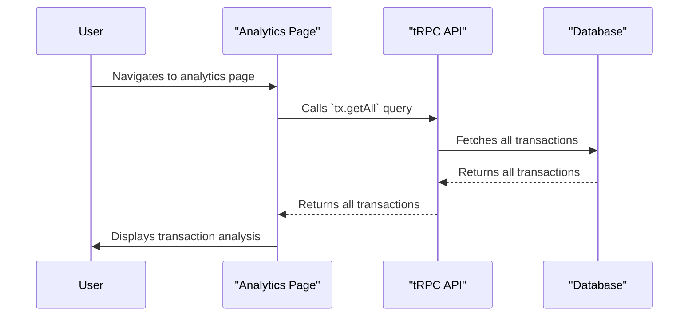

### View Transaction Analysis Sequence Diagram Documentation

This diagram illustrates the sequence of events that occur when a user views the transaction analysis page.

1.  **User navigates to analytics page:** The user navigates to the `/analytics` page in the application.
2.  **`tx.getAll` query:** The `AnalyticsPage` component calls the `tx.getAll` tRPC query to fetch all of the user's transactions.
3.  **Database query:** The tRPC API queries the database for all of the user's transactions.
4.  **Return transactions:** The database returns all of the user's transactions to the tRPC API.
5.  **Return transactions to client:** The tRPC API returns all of the user's transactions to the `AnalyticsPage` component.
6.  **Display analysis:** The `AnalyticsPage` component processes the transactions and displays an analysis to the user.

I have now created all the sequence diagrams for the key user interactions. I will now mark this step as complete.
